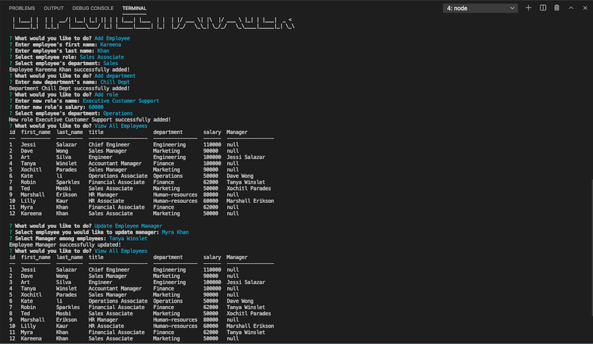

# Employee-Management-System

## Description

The Employee Management System is a Content Management System designed to view and manage the departments, roles, and employees in a company
for an organized and planned business.
 

[The Link to My Github Repository](https://github.com/kaurshalpreet/Employee-Management-System)

---

## Table of Contents

1. [Installation](#Installation)
1. [Usage](#Usage)
1. [Credits](#Credits)
1. [License](#License)

---

## Installation

npm init  
npm i mysql  
npm i inquirer  
npm i console.table  
npm i figlet  

---

## Usage

 This is a command line application that allows the user to Add Departments, Role, Employees to the Database. Also allows the user to View Departments, roles and employees. The User can also update employees role. The user will also be able to remove departments, roles and employees. Once all the dependencies are installed, run npm run start in your termial and respond to all the prompts.  

Sample screenshots showing the user input and result is shown below.

You can also find a walkthrough video that demonstrates the functionality of the application [here](https://drive.google.com/file/d/1TJwoAB7kgpbB48F3PWLvoIbDt0DI9UrU/view)

This way the user can keep a track and manage systematically the employees, departments and roles of the employees of a company.

---

## Credits

- UC Davis BootCamp - Instructors and TAs
- https://www.w3schools.com/
- https://www.youtube.com/
- https://www.google.com/
- https://www.npmjs.com/package/inquirer
- https://choosealicense.com/licenses/
- https://shields.io/category/license

---

## License

#### This application is licensed under the [MIT License](https://opensource.org/licenses/MIT)

---

## Questions

#### You can reach me via my [Github](https://github.com/kaurshalpreet) account.

#### Email me with any additional questions at: kaurshalpreet@gmail.com